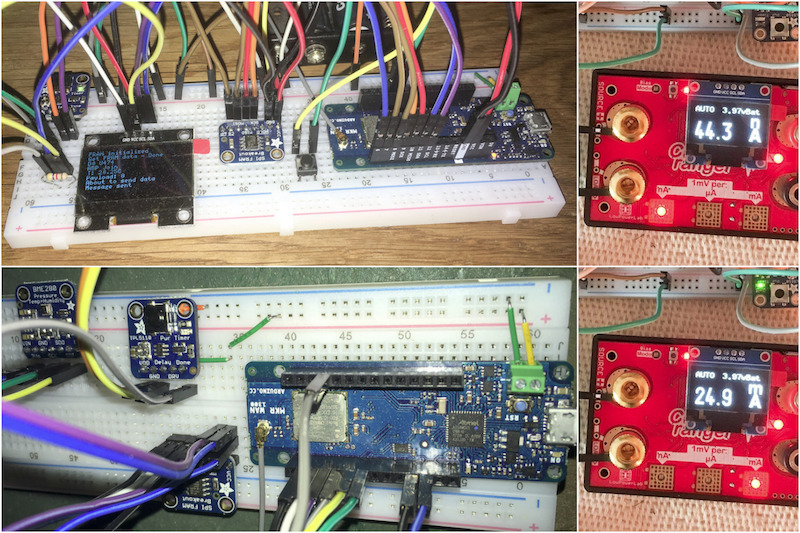
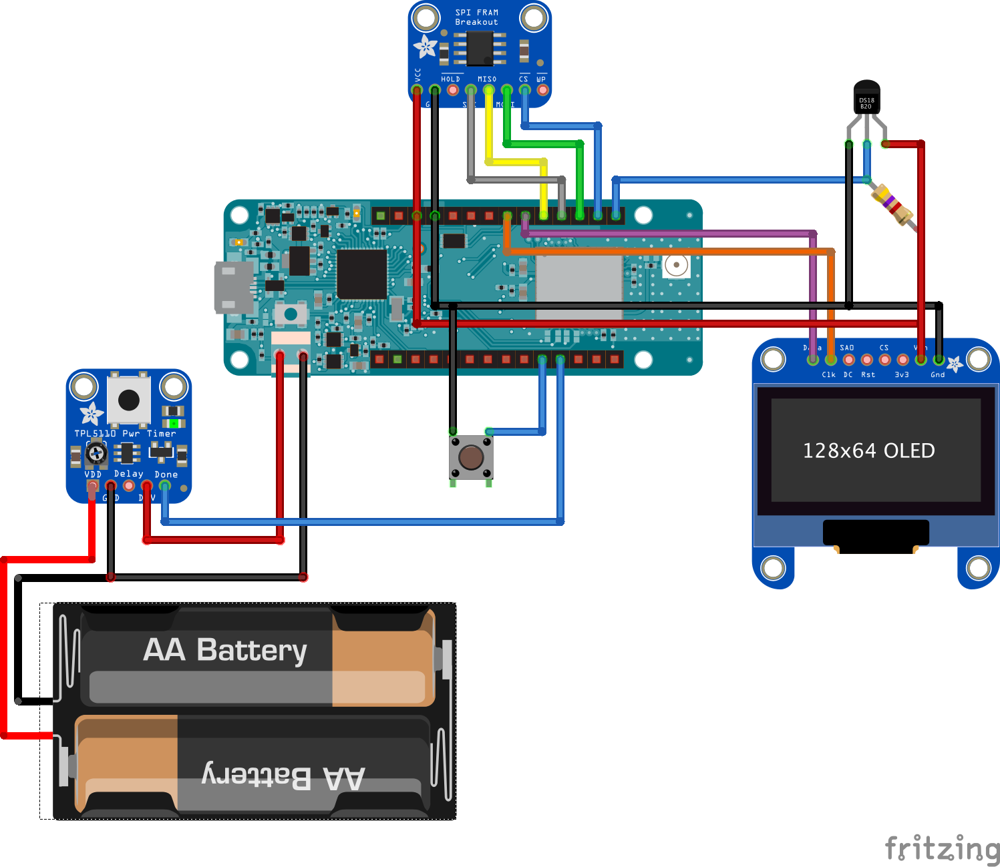

TTN MKRWAN Node 
===============

# Background
Proof of concept for an "ultra low power" LoRaWAN / [The Things Network](https://www.thethingsnetwork.org/) node using the [Arduino MKR WAN 1300](https://store.arduino.cc/mkr-wan-1300).

The MKR WAN 1300 uses too much power in sleep mode to be used as ultra low power device (a bit more than 1mA).

This proof of concept uses a [Texas Instrument TPL5110](http://www.ti.com/product/TPL5110) Ultra Low Power Timer to bring the sleep current under 50nA.  
As the device is completely powered off during sleep time we use a [FRAM](https://fr.wikipedia.org/wiki/Ferroelectric_Random_Access_Memory) module to save the LoRaWAN session keys and frame counters.

Two test nodes:  
Top left: display and [Maxim DS18B20](https://datasheets.maximintegrated.com/en/ds/DS18B20.pdf) temperature sensor  
Bottom left: [Bosch BME280](https://www.adafruit.com/product/2652) temperature humidity and pressure sensor  
  
Top right: sleep current  
Bottom right: running current (node with the display)

# Theory of operation
1. TPL5110 wakes up and power on the MKR WAN 1300
1. Read saved data from FRAM
1. Join the network
  1. OTAA the first time (no data in FRAM)
  1. ABP using the saved session keys and frame counters afterwards
1. Collect data from sensors
1. Send LoRaWAN payload in [Cayenne LPP format](https://mydevices.com/cayenne/docs/lora/#lora-cayenne-low-power-payload)
1. Check for downlink message
1. Enter sleep mode (raise the _Done_ pin of the TPL5110)

# Hardware requirement
The code relies on the following hardware:
- [Arduino MKR WAN 1300](https://store.arduino.cc/mkr-wan-1300) -- Firmware 1.1.7 or newer
- [TPL5110 breakout](https://www.adafruit.com/product/3435)
- [FRAM breakout](https://www.adafruit.com/product/1897)
- Sensors, sample code provided for
  - Battery voltage (using the built-in divider)
  - [Maxim DS18B20](https://datasheets.maximintegrated.com/en/ds/DS18B20.pdf) temperature sensor (One Wire)
  - [Bosch BME280](https://www.adafruit.com/product/2652) temperature humidity pressure sensor
- Optional
  - SH1106 128X64 I2C display for debugging
  - Button to force reset (OTAA join) at boot time

Any similar hardware should work, but might need some code change.

# Software dependencies
The [Arduino IDE](https://www.arduino.cc/en/Main/Software) with following libraries (all available from the Arduino Library Manager):
- [Arduino MKRWAN](https://github.com/arduino-libraries/MKRWAN) version 1.1.7 or newer
- [Adafruit FRAM](https://github.com/adafruit/Adafruit_FRAM_SPI) (SPI version)
- [TheThingsNetwork](https://github.com/TheThingsNetwork/arduino-device-lib). Do __not__ install version 2.5.12, it won't compile on the MKR WAN 1300 (See [#246](https://github.com/TheThingsNetwork/arduino-device-lib/pull/246)); 2.5.11 works fine.
- For the BME280 sensor
  - [Adafruit Unified Sensor](https://github.com/adafruit/Adafruit_Sensor)
  - [Adafruit BME280](https://github.com/adafruit/Adafruit_BME280_Library)
- For the Maxim DS18B20 sensor
  - [OneWire](https://github.com/PaulStoffregen/OneWire)
  - [DallasTemperature](https://github.com/milesburton/Arduino-Temperature-Control-Library)
- For the optional display: [U8g2](https://github.com/olikraus/u8g2)

# Sample setup
Sample setup with an SH1106 OLED display and a DS18B20 sensor:

# Operations
## Software configuration
- Copy `arduino_secrets_distr.h` to `arduino_secrets.h` and enter your keys obtained from TheThingsNetwork console
- In `TTNMkrWanNode` uncomment the _defines_ for your sensors.  
The Voltage sensor is always available, it uses the built-in divider.
Note that givent the fact that the divider is 1/3rd and the voltage reference is 1.0v, the maximum you can measure is 3.0v...
- In `debug.h` choose your debugging option:
  - `#define DEBUG` commented out: no debug code generated
  - `#define DEBUG` uncommented: debug on the (USB) serial console.
  The node will wait for the console!
  - `#define DEBUG` and `#define OLED` uncommented: debug messages on the OLED display.
- In `ttn.h` you can set your LoRaWan default port and data rate

## Power
Disconnect power coming from the TPL5110 (DRV) when powering from USB.

## Initialisation
If the FRAM does not contain valid data or if the button is pressed when the MKR WAN 1300 starts, the device will perform an OTAA join.  

## Downlink messages
Before sleeping the node will check for downlink message:
- 0x01: Reset. The node will perform an OTAA join during next cycle
- 0x02 0xpp: Set port. The node will use port `pp` when sending data
- 0x03 0xdd: Set data rate. The node will use the requested data rate.

## Sleep time
- When powered from USB, the node will idle for 5 minutes then reset itself
- When powered through the TPL5110 the sleep time is driven by a resistor (on the Adafruit breakout you can use the trimpot on the board)
